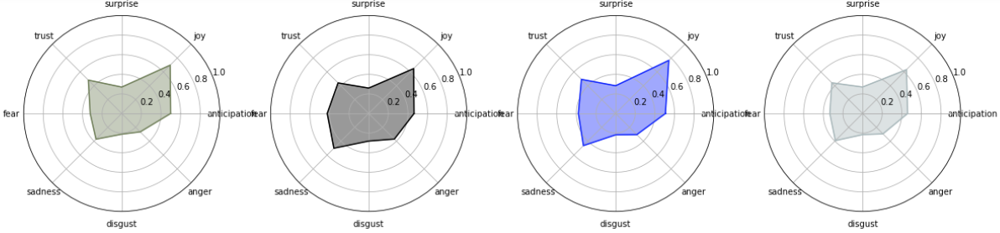

### Motivation
During this past summer (2020) I had been delving more into data science projects, specifically with natural language processing, and I wanted to take on my own project to learn more about slightly more advanced techniques. Conveniently, around the same time, the site had faced a new surge of popularity, and a friend of mine showed it to me. I was immediately intrigued just by the actual content of the site, but quickly realized it as a possible opportunity given the large amount of text data. I thought it would be incredibly interesting to analyze, and a great way to learn more about data science and NLP with such an interesting dataset. Soon after I reached out the site's creator, Rora Blue, and she was incredibly welcoming and supportive of my work throughout the process.

### Data
The Unsent Project is a crowdsourced arts project featuring a collection of unsent messages to first loves. People submit a message addressed to their first love, and pick a color they associate with the message. I web scraped over 200,000 of these post submissions from the past year starting from July 2020. Web scraping was also a new skill for me, so it took some time, but with some effort put into finding my way around the website, I got the data. For reference, posts look like this:

When scraped, they made up a table that resembled this (look to the exploratory analysis notebook for further detail):

| name | date | color | message |
| --- | --- | --- | --- |
| Jesse | June 30 2020 | Orange | I'll always remember you. |
| Celine | June 30 2020 | Light Blue | I'll never forget you. |

### Results
Note: This project is near the end of it's completion, but it is still in progress.
Because this project was mainly for the sake of learning, I would consider it very successful. I got further experience with fundamental natural language processing techniques, but also learned more advanced techniques, such as LSA, LDA, and NMF topic modeling, along with building text classification models using Naive Bayes and neural networks with Keras. I found some very interesting insights, and produced some visualizations, some of which I'll drop below. The models were incredibly inaccurate, but as of now, I accredit the low accuracy to the possible indistinguishability of the data. I haven't yet completely documented all of my code, but you can check out my jupyter notebooks for a more in depth look at what I found and how I conducted my analysis.

Here are a few basic visualizations, but there is plenty more interesting analysis in my notebooks.

