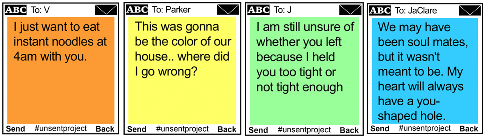

### Motivation
During this past summer (2020) I had been delving more into data science projects, specifically with natural language processing, and I wanted to take on my own project to learn more about slightly more advanced techniques. Conveniently, around the same time, the site had faced a new surge of popularity, and a friend of mine showed it to me. I was immediately intrigued just by the actual content of the site, but quickly realized it as a possible opportunity given the large amount of text data. I thought it would be incredibly interesting to analyze, and a great way to learn more about data science and NLP with such an interesting dataset. Soon after I reached out the site's creator, Rora Blue, and she was incredibly welcoming and supportive of my work throughout the process.

### Data
Because of some difficulties with wordpress, I ended up web scraping 200,000 posts from the past year starting from July 2020. This was also a new skill for me, so it took some time, but with some effort put into finding my way around the website, I got the data. For reference, posts look like this:

When scraped, they came in a table that resembled this (look to the exploratory analysis notebook for further detail):
| name | date | color | message |
| --- | --- | --- | --- |
| Jesse | June 30 2020 | Orange | I'll always remember you. |
| Celine | June 30 2020 | Light Blue | I'll never forget you. |
